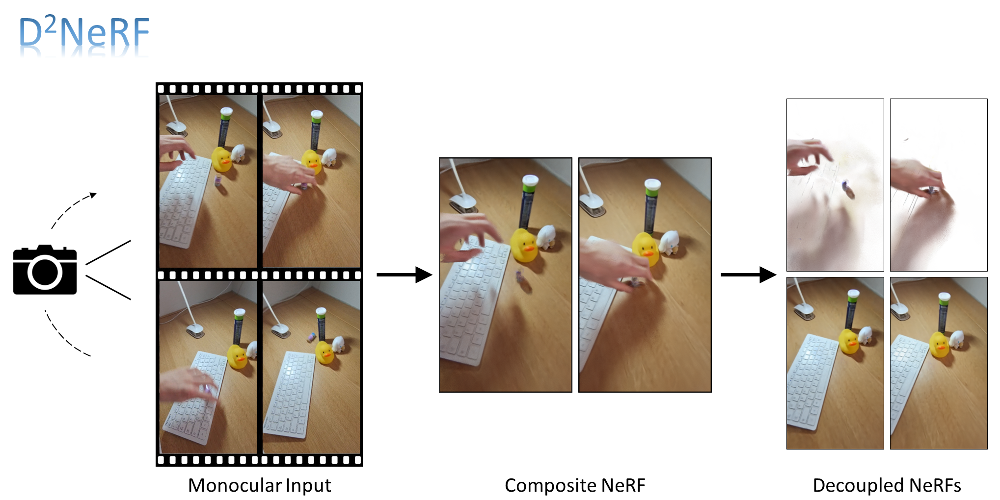

# D<sup>2</sup>NeRF: Self-Supervised Decoupling of Dynamic and Static Objects from a Monocular Video

This is the code for "D<sup>2</sup>NeRF: Self-Supervised Decoupling of Dynamic and Static Objects from a Monocular Video".



* [Project Page](https://d2nerf.github.io/): https://d2nerf.github.io/
<!-- * [Paper](coming): coming -->

This codebase implements D<sup>2</sup>NeRF based on [HyperNeRF](https://github.com/google/hypernerf) 


<!-- ## Demo

Our code We provide an easy-to-get-started demo using Google Colab!

These Colabs will allow you to train a basic version of our method using
Cloud TPUs (or GPUs) on Google Colab.

Note that due to limited compute resources available, these are not the fully
featured models and will train quite slowly and the quality will likely not be that great.
If you would like to train a fully featured model, please refer to the instructions below
on how to train on your own machine.

| Description      | Link |
| ----------- | ----------- |
| Process a video into a dataset| [](https://colab.research.google.com/github/google/nerfies/blob/main/notebooks/Nerfies_Capture_Processing.ipynb)|
| Train HyperNeRF| [](https://colab.research.google.com/github/google/hypernerf/blob/main/notebooks/HyperNeRF_Training.ipynb)|
| Render HyperNeRF Videos| [](https://colab.research.google.com/github/google/hypernerf/blob/main/notebooks/HyperNeRF_Render_Video.ipynb)| -->


## Setup
The code can be run under any environment with Python 3.8 and above.
(It may run with lower versions, but we have not tested it).

We recommend using [Miniconda](https://docs.conda.io/en/latest/miniconda.html) and setting up an environment:

    conda create --name d2nerf python=3.8

Next, install the required packages:

    pip install -r requirements.txt

Install the appropriate JAX distribution for your environment by  [following the instructions here](https://github.com/google/jax#installation). For example:

    pip install --upgrade "jax[cuda]" -f https://storage.googleapis.com/jax-releases/jax_releases.html


## Training
Please download our dataset [here](empty).

After unzipping the data, you can train with the following command:

    export DATASET_PATH=/path/to/dataset
    export EXPERIMENT_PATH=/path/to/save/experiment/to
    export CONFIG_PATH=configs/rl/001.gin
    python train.py \
        --base_folder $EXPERIMENT_PATH \
        --gin_bindings="data_dir='$DATASET_PATH'" \
        --gin_configs $CONFIG_PATH

To plot telemetry to Tensorboard and render checkpoints on the fly, also
launch an evaluation job by running:

    python eval.py \
        --base_folder $EXPERIMENT_PATH \
        --gin_bindings="data_dir='$DATASET_PATH'" \
        --gin_configs $CONFIG_PATH

We also provide an example script at `train_eval_balloon.sh`

The two jobs should use a mutually exclusive set of GPUs. This division allows the
training job to run without having to stop for evaluation.


## Configuration
* Similiar to HyperNeRF, We use [Gin](https://github.com/google/gin-config) for configuration.
* We provide a couple preset configurations:
    - `configs/decompose/`: template configurations defining shared comfigurations for NeRF and HyperNeRF
    - `configs/rl/`: configurations for experiments on real-life scenes. 
    - `configs/rl/`: configurations for experiments on synthetic scenes. 
* Please refer to `config.py` for documentation on what each configuration does.


## Dataset
The dataset uses the [same format as Nerfies](https://github.com/google/nerfies#datasets).

For synthetic scenes generated using [Kubric](https://github.com/google-research/kubric), we also provide the worker script
, named `script.py` under each folder.


## Running on own dataset

Because our code is fully compatiable with HyperNeRF dataset, thanks to them, you can simply use their [colab notebook](https://colab.research.google.com/github/google/nerfies/blob/main/notebooks/Nerfies_Capture_Processing.ipynb) to process your video and prepare a dataset for training.


<!-- ## Citing
If you find our work useful, please consider citing:
```BibTeX
@article{park2021hypernerf,
  author = {Park, Keunhong and Sinha, Utkarsh and Hedman, Peter and Barron, Jonathan T. and Bouaziz, Sofien and Goldman, Dan B and Martin-Brualla, Ricardo and Seitz, Steven M.},
  title = {HyperNeRF: A Higher-Dimensional Representation for Topologically Varying Neural Radiance Fields},
  journal = {ACM Trans. Graph.},
  issue_date = {December 2021},
  publisher = {ACM},
  volume = {40},
  number = {6},
  month = {dec},
  year = {2021},
  articleno = {238},
}
``` -->
